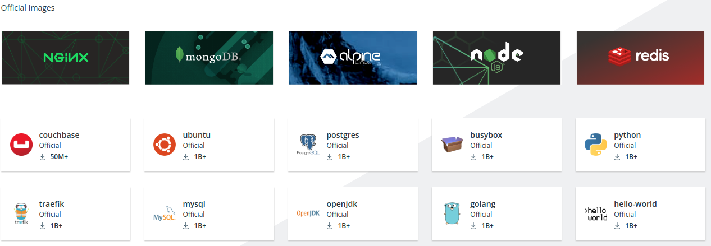
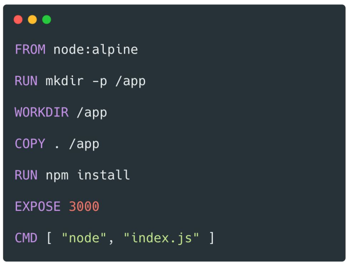
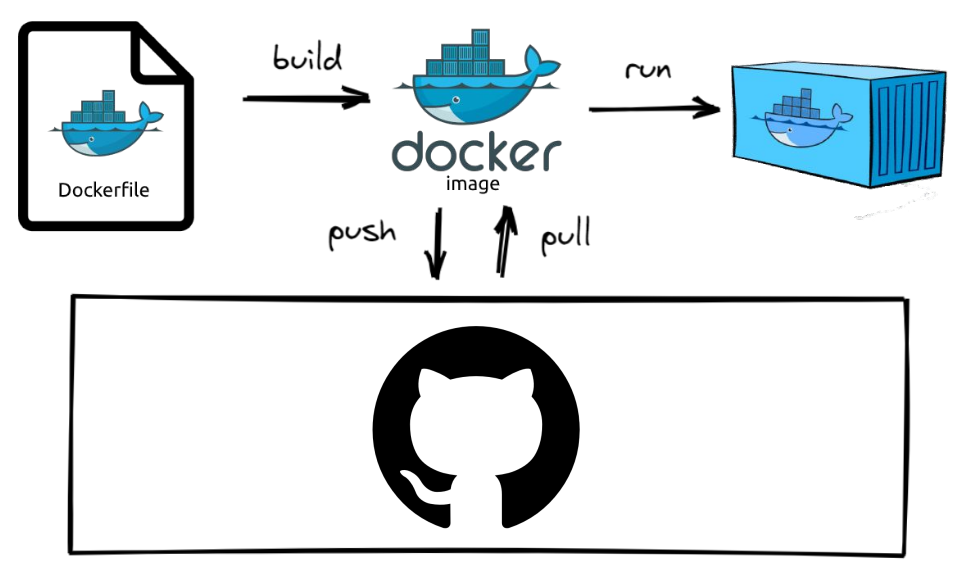
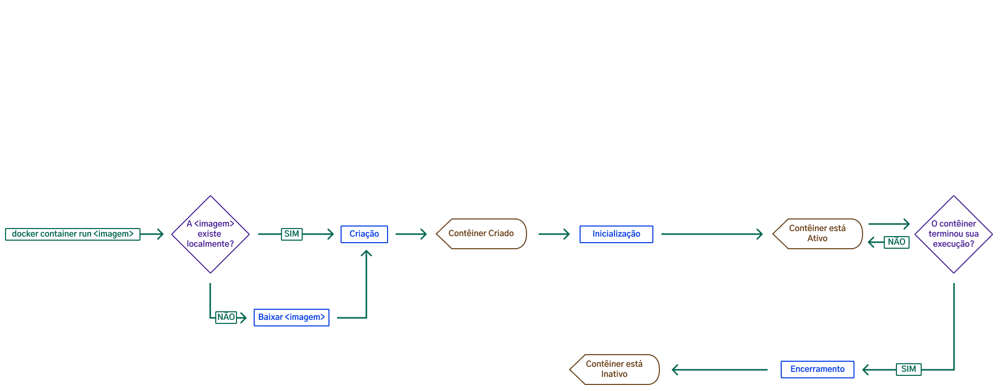
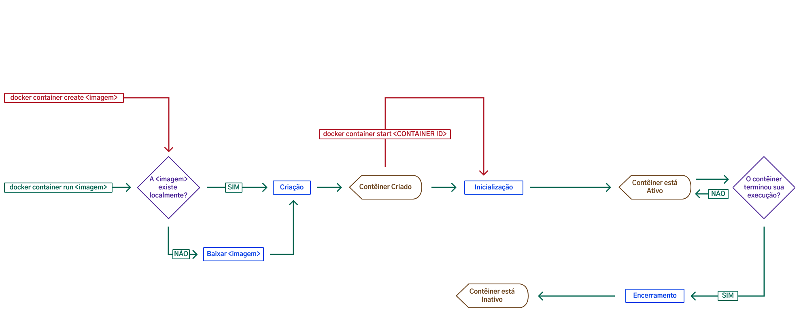

### Introdução a Docker


---

### Combinados

* Chat fechado durante a aula
* Microfones Mutados
* Dúvidas no Slido
* Não existe dúvida boba
* Dúvidas sobre Instalação do Docker ou fora do contexto devem ser levadas para o slack ou mentoria.

---

### Tudo começa ao finalizar uma entrega

Falaremos de alguns conceitos presentes em nosso dia a dia, porém podem não ser tão evidente

- Não precisa decorar nada, o importante é entender a abstração por de trás do tema

---

#### Etapas de produção de um software

> Desenvolvimento

> Testes

> Produção

---

#### Etapas de produção de um software

> Tomaremos como exemplo o ambiente de **produção**

---

### Ambiente: Produção

- Nesse contexto, não é muito prático/escalável que nós simplesmente mandemos o código para outras pessoas, já que teríamos que mandar também, instruções bem detalhadas de como fazer aquela aplicação funcionar

---

{width=70%}

---

### Ambiente: Produção

- Configurações de SO (Linux, Mac, Windows)
- Banco de dados
- Softwares
- Bibliotecas
- Configurações

---

### É por isso que se torna inviável ter que subir e configurar um sistema toda vez que precisarmos rodar um aplicativo.

---

### Docker chegou para resolver esse problema

> Tudo que é instalado em nossa máquina pode ser conteinerizado utilizando Docker

---

### Docker Hub


---

### Quanto custa o Docker?

[Go to docker](https://www.docker.com/pricing)

---

#### Tudo começa no Dockerfile

{width=80%}

---

### Dockerfile

- Qual sistema devo utilizar;
- Quais comandos devo rodar nesse sistema;
- Qual a pasta que vou trabalhar dentro da imagem;
- Quais comandos devo utilizar para instalar sua aplicação;
- Qual porta, nesse container, dará acesso a sua aplicação;
- Qual comando devo utilizar para rodar sua aplicação.

---

#### Fluxo padrão
{width=80%}

Esse é um diagrama bastante simplista mas ele ajuda a visualizar o fluxo padrão do Docker:

---

### Não se preocupe, veremos mais sobre imagens nas próximas aulas


---

### Pull/Push ?

{width=60%}

Registry é o serviço que hospeda suas imagens de maneira que é possível fazer operações de push e pull

---

### Mágica Docker

{width=70%}

---

⇩ ⇩ ⇩ ⇩ ⇩ ⇩ ⇩ ⇩ ⇩ ⇩ ⇩ ⇩ ⇩ ⇩

[Não clique aqui](https://docs.google.com/presentation/d/11HZB2Uk06semyxrDYB_DCaA6DpjZeq8CgxjzTLTtJks/edit#slide=id.geeeee3e2a0_1_97)

⇧⇧⇧⇧⇧⇧⇧⇧⇧⇧⇧⇧⇧⇧⇧⇧⇧⇧

---


---

### Testando containers na nuvem

- Cadastro: https://hub.docker.com/
- Brincar: https://labs.play-with-docker.com/

---

#### Você quer brincar na neve?

[Play With Docker](https://labs.play-with-docker.com/)


---

### Criando uma instância

- Ao criarmos uma instância o site nos da 4 horas para práticar
- E pra quem pretende somente conhecer e se familiarizar com a ferramenta, esse tempo é mais do que suficiente!

---

### Verificando instalação e versão

```sh
$ docker -v
```

---

#### Ainda não iniciamos nenhum container

```sh
$ docker ps -a # versão antiga
$ docker container ls -a # nova versão
$ docker container ps -a # nova versão
```

---

#### Criação, início e encerramento de um contêiner

```sh
$ docker container run
```



---

#### Hello World

```sh
$ docker container run hello-world
```

---

#### Respostas

1. O cliente de terminal do Docker contatou seu próprio serviço (que é o motor);
2. Esse serviço do Docker baixou (deu pull) na imagem hello-world, lá do Docker Hub;
3. Esse serviço criou um novo container baseado nessa imagem, que tem um pequeno programa que imprime essas informações;
4. Esse serviço devolve essas informações ao cliente, que os imprime no seu terminal.

---

### Verificando novamente os containers

```sh
docker container ls -a 
# -a retorna também os containers inativos
```

---

### Continuando com a imagem Hello-World

- To try something more ambitious, you can run an Ubuntu container with:
```sh
$ docker run -it ubuntu bash
# ou
$ docker container run -it ubuntu bash
# -it inception (inicia um terminal interativo)
```

---

> Nesse momento, o Docker, além de baixar uma imagem do Ubuntu, iniciou um terminal interativo dentro dele (com o comando -it), numa espécie de inception que vai atrelar o terminal do container ao seu, permitindo que você rode os comandos diretamente no Ubuntu.

---

> Conseguimos extrair informações de qual versão está rodando nesse container

```sh
$ cat /etc/*-release
```

---

### Welcome Ubuntu

> É possível rodar praticamente todos os comandos do ubuntu

```sh
$ apt-get update && apt-get upgrade
$ ls
$ exit
```

---

### Verificando novamente os containers

```sh
docker container ls -a 
# -a retorna também os containers inativos
```

---

#### Criando um container sem inicializa-lo



---

#### Criando um container sem inicializa-lo

- É o mesmo início de processo que o run, contudo, o contêiner não é iniciado automaticamente;
- Nesse caso, é necessário iniciar o contêiner utilizando o comando start do docker.

---

#### Criando um container sem inicializa-lo

```sh
$ docker container create -it ubuntu bash 
```

---

#### Como inicializar um Container já criado?

1. Observe o retorno da criação do container
2. Liste todos os containers 
```sh
$ docker container ls -a
```

- É possível utilizar o CONTAINER ID (hash) para inicializa-lo

---

#### Iniciando o container

```sh
$ docker start <hash-aqui>
```

---

#### Verifique o status

```sh
$ docker container ls -a
```

---

### Retomando controle de um container

> E, como iniciamos o contêiner de forma interativa, conseguimos utilizar o comando attach, para retomar esse mesmo contêiner:

```sh
$ docker container attach <hash-aqui>
```

---

> Vamos criar mais um contêiner, só que dessa vez, ele deve ser criado e iniciado já em segundo plano.

---

```sh
$ docker container run -dit ubuntu
# -d desacoplado
# -it acesso ao terminal  
```

---

> Uma vez que temos o contêiner rodando, podemos parar, inicializar, pausar e reiniciar ele sem nenhum problema:


```sh
$ docker container stop <hash-aqui>
$ docker container start <hash-aqui>
$ docker container restart <hash-aqui>
```

---

> Acesso a containers inativos

```sh
$ docker container pause <hash-aqui>
$ docker container attach <hash-aqui>
$ docker container unpause <hash-aqui>

```

---

### Removendo um container

```sh
$ docker container rm <hash-aqui>
$ docker container rm -f <hash-aqui>
$ docker container prune
```