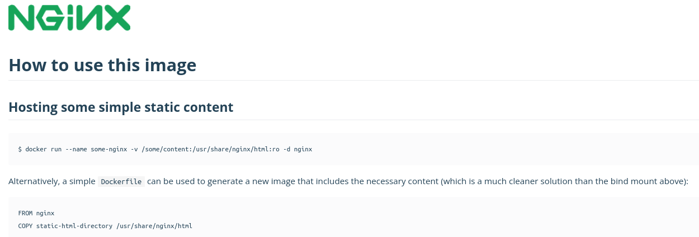

**NGINX   ==>   [Link do Site](https://www.nginx.com/)  |  [Link do Docker Hub](https://hub.docker.com/_/nginx)**

> docker container run -d nginx (Container rodando em segundo plano)

> docker ps

