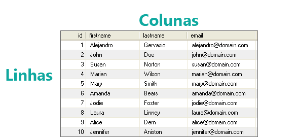

## O que é SQL?

É a linguagem usada para criar, pesquisar, extrair e também manipular dados dentro de um banco de dados relacional.

**Alguns Comandos:** `SELECT`, `UPDATE`, `DELETE`, `INSERT`, `WHERE`, ... etc

## Como as informações são armazenadas?

Todas as pesquisas realizadas dentro de um banco de dados são feitas em tabelas. Tabelas possuem linhas e colunas.

	

