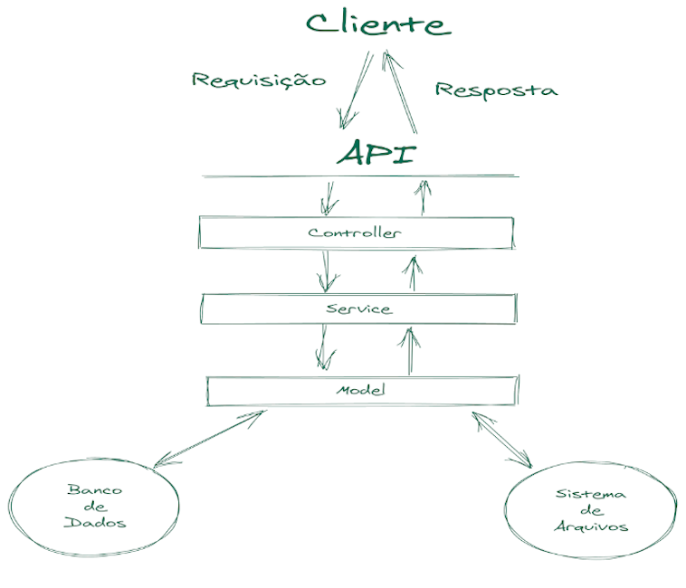

As camadas **Controller** e **Service** são responsáveis por:

 - Receber e tratas os dados da requisição;
 - Aplicar as regras de negócio da aplicação antes que qualquer comunicação com o banco seja realizada.

