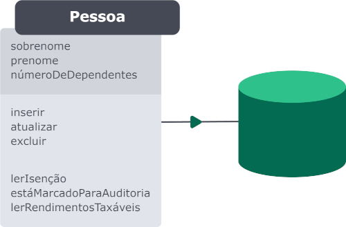

## Mapeamentos:
Existem dois padrões que são mais utilizados para realizar os mapeamentos. Sendo eles:

### Data Mapper
A classe que representa a tabela do banco de dados não deve conhecer os recursos necessários para realizar as transações com o banco de dados.

### Active Record
A classe que representa a tabela conhece os recursos necessários para realizar as transações no banco de dados.

**Qual usar?** Tudo depende do tipo de projeto. O estilo Active Record é mais simples de se implementar, mas o Data Mapper facilita atualizações e mudanças na estrutura do banco de dados.

