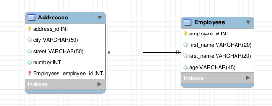

O dado banco de Dados será usado no exemplo:

01. Execute:
- npm init -y
- npm i express nodemon sequelize mysql2
- npm i sequelize-cli
- npx sequelize-cli init

02. Configure o arquivo `config/config.json` (development)
- Username;
- Senha;
- Database;
- Host (Manter);
- Dialect.

03. Criando Banco de Dados: `npx sequelize db:create`

04. Criando a Migration Employees: `npx sequelize migration:generate --name create-employees`

05. Criando a Migration Addresses: `npx sequelize migration:generate --name create-addresses`

06. Executar as Migrations: `npx sequelize db:migrate`

07. Criando os Seeders:
- npx sequelize seed:generate --name employees
- npx sequelize seed:generate --name addresses

08. Executar Seeders: `npx sequelize db:seed:all`
