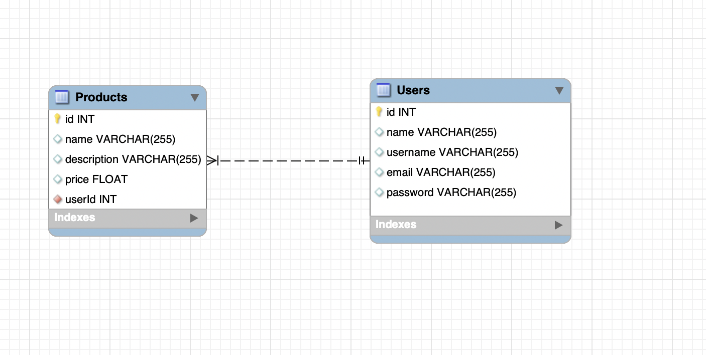

01. Criando o Banco: **npx sequelize-cli db:create**
02. Migrations: **npx sequelize-cli db:migrate**
03. Seeds: **npx sequelize-cli db:seed:all**

## Criar uma table Users:



01. Modo facil de criar o migrate + model
```
npx squelize-cli model:create --name Users --attributes name:string,username:string,email:string,password:string
```

- Mudar o nome do model para singular (`user`)

02. Rodando as migrations:
```
npx sequelize-cli db:migrate
```

