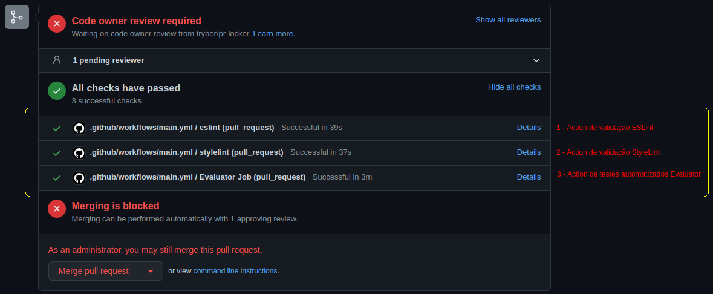
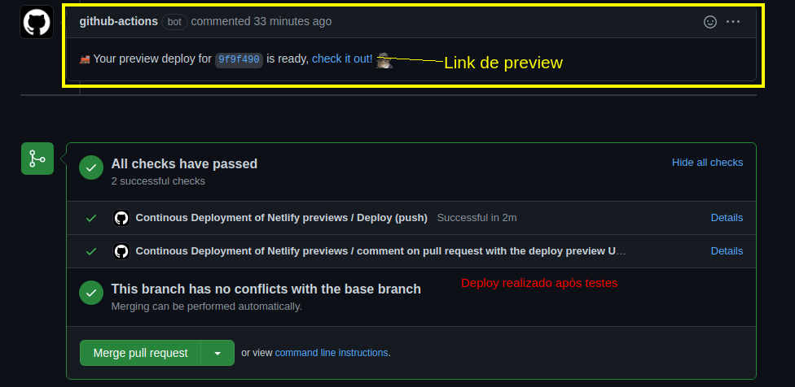

## Continuous Integration (CI)

É um processo de automatização.Essa é uma solução ideal para evitar os conflitos quando diversas funcionalidades de uma aplicação são desenvolvidas de forma simultânea por um time de pessoas desenvolvedoras.

### Actions GitHub
As Actions são ações propriamente ditas que realizam algum tipo de evento, antes ou depois de realizar um push por exemplo, seja ele para a branch principal ou uma branch especifica, tudo irá depender do arquivo de configuração `.yml`, logo logo veremos onde.



No exemplo acima, são executadas três Actions, duas validações de estilização de código (eslint e stylelint) e uma validação dos testes da aplicação. Com isso implementado só será possível mergear esta branch caso todas as validações (Actions) sejam executadas com sucesso, caso haja algum conflito o merge será bloqueado.

**Exemplos:**

```
on:
  pull_request:
    types: [opened, synchronize]

jobs:
  eslint:
    runs-on: ubuntu-18.04
    steps:
      - uses: actions/checkout@v2
      - uses: actions/setup-node@v1.4.4

  stylelint:
    runs-on: ubuntu-18.04
    steps:
      - uses: actions/checkout@v2
      - uses: actions/setup-node@v1.4.4

  evaluator:
    name: Evaluator Job
    runs-on: ubuntu-18.04
    needs: [eslint, stylelint]
    steps:
      - uses: actions/checkout@v2
      - name: Evaluator step
        id: evaluator
        uses: betrybe/cypress-evaluator-action@v5
```

**Localização do arquivo `.github/workflows/main.yml ou build.yml`**

## Continuous Delivery (CD)
Está relacionado com a entrega contínua ou implantação contínua. No geral representa mudanças feitas por uma pessoa desenvolvedora, que são automaticamente testadas contra bugs e/ou falhas e carregadas a algum repositório, como o GitHub por exemplo.

O objetivo final é garantir visibilidade e comunicação entre todas as equipes de desenvolvimento e garantir o mínimo de esforço na implementação de novos códigos em produção.

Um exemplo de CD é o deploy automatizado de uma aplicação, ao ser realizado alguma alteração na branch principal, um novo deploy é realizado de forma automática.



## Pipeline de CI/CD


Em linhas gerais CI/CD geram monitoramentos e automações contínuas em todo o ciclo de vida da aplicação, incluindo também as etapas de testes, integração, entrega e implantação. Essas práticas muitas vezes são chamadas de "Pipeline de CI/CD" e são utilizadas juntamente das metodologias ágeis.