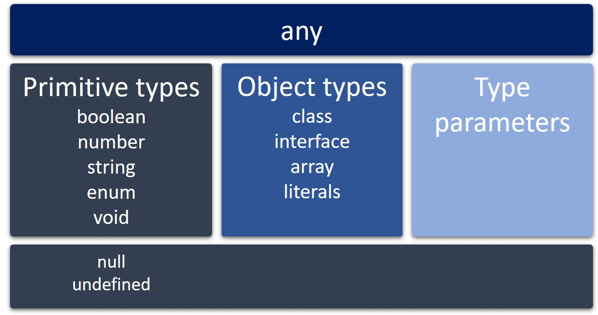

Em TypeScript todos os tipos são subtipos de um tipo principal chamado any, e este é um tipo que pode representar qualquer valor em JavaScript. Os demais tipos são os tipos primitivos, tipos de objeto ou parâmetros de tipo.



## Tipos Primitivos

### boolean
Recebe verdadeiro(true) ou falso(false)
```js
let yes: boolean = true;
let no: boolean = false;
```

### number
Recebe valores numéricos e assim como no JavaScript todos são valores de ponto flutuante.
```js
// cria uma variável e diz que o tipo é number mas não seta o valor
// isso não funciona com const
let x: number;

let y: number = 0;
let z: number = 123.456;
```


### string
Recebe uma sequência de caracteres armazenados como unidades de código UTF-16 Unicode.
```js
let s: string;
let empty: string = "";
let abc: string = 'abc';
```

### void
Existe apenas para indicar a ausência de um valor, como em uma função sem valor retornado.
```js
function sayHelloWorld(): void {
  console.log("Hello World!");
}
```

## Exemplo
```js
let flag = true;
const numberPI = 3.1416;
let message = "Hello World!";
```
