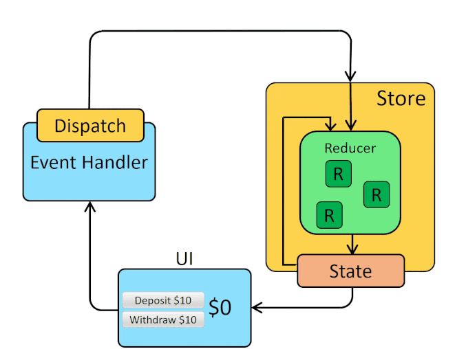

1. Um Store é criado para armazenar todos o estado da aplicação;
2.  O Store é disponibilizado através do Provider para todos os componentes da aplicação;
3.  Os componentes usam o connect para conectarem-se ao Store ;
4.  As pessoas que utilizam a aplicação interagem com ela e disparam eventos;
5.  Estes eventos têm o nome de Actions e são enviadas ao Store através de um dispatch ;
6.  Os Reducers recebem essas Actions e alteram o estado da aplicação (criando um novo estado) e salvando no Store ;
7.  Os componentes conectados ao Store "ouvem" estas mudanças e atualizam a View (visualização).

## Checklist react-redux:

1. npx create-react-app my-app-redux;
2. npm install --save redux react-redux;
3. npm install.

**Criar dentro do diretório src:**

1. diretório actions;
2. diretório reducers;
3. diretório store.

**Criar dentro do diretório actions:**

1. arquivo index.js.

**Criar dentro do diretório reducers:**

1. arquivo index.js.

**Criar dentro do diretório store:**

1. arquivo index.js.

**Em src/index.js:**

1. definir o Provider, <Provider store={ store }> , para fornecer os estados à todos os componentes encapsulados em <App />.

**Se a sua aplicação não terá outras páginas, não é necessário configurar as rotas. Caso contrário:**

1. npm install react-router-dom;

**Em src/index.js:**

1. definir o BrowserRouter, <BrowserRouter>.

**No arquivo App.js:**

1. definir o Switch, <Switch>;
2. definir a Route, <Route>.

**O BrowserRouter, o Switch e a Route são três componentes essenciais para trabalhar rotas em React. Caso necessário:**

1. criar o diretório components;
2. criar o diretório pages.

**No arquivo store/index.js:**

1. importar o rootReducer e criar a store;
2. configurar o Redux DevTools.

**Na pasta reducers:**

1. criar os reducers necessários;
2. configurar os exports do arquivo index.js.

**Na pasta actions:**

1. criar os actionTypes;
2. criar as actions necessárias.

**Nos componentes:**

1. criar a função mapStateToProps se necessário;
2. criar a função mapDispatchToProps se necessário;
3. fazer o connect (se necessário).
