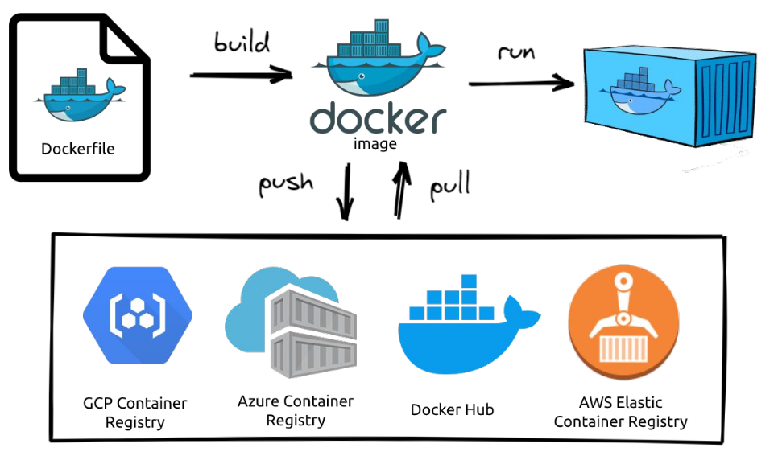

**container** é um processo Docker que, internamente, possui tudo aquilo que é necessário para seu funcionamento: Sistema Operacional (Binários e Bibliotecas) e recursos necessários para sua aplicação.

A **imagem** é uma espécie de "fotografia" de um container , nós resgatamos uma imagem, quando queremos iniciar um novo container a partir de uma estrutura já conhecida.

## Containers

Um container não é uma máquina virtual, pois embora compartilhem de mesmas características, o container é uma instância isolada (tem apenas uma finalidade) e compartilha dos mesmos recursos do sistema operacional hospedeiro, o que damos o nome de Virtualização a nível de Sistema Operacional (OS-level virtualization).

**Um container não deve ser utilizado para abrigar várias aplicações, e é justamente por isso que ele ocupa muito menos espaço que uma VM. Sua tendência é de manter somente o essencial no seu conteúdo.**

## Imagens

Imagens podem se referir a praticamente qualquer tipo de container.
Eemplo o próprio sistema operacional Ubuntu possui uma imagem oficial no Docker Hub ([Imagem Ubuntu](https://hub.docker.com/_/ubuntu)). 

**O que é o [Docker Hub](https://hub.docker.com/)?** É o principal repositório de imagens Docker atualmente. Nele, possuímos o que é chamado de Registro (`Registry` é um sistema de armazenamento e entrega, no qual podemos ter um usuário com nossas próprias imagens), onde requisitamos essas imagens.

## Fluxo Padrão

**1º Tudo começa no arquivo Dockerfile**

	. Instruções necessárias para que possamos gerar uma imagem;
	
	. Informações sobre qual sistema operacional usar, e quais comandos dever ser execultados apor a imagem rodar em um container.

**2º Aplicar push ou pull em uma imagem no Resitry**

	. Possibilidade de dar pull em sua própria imagem ou outra;
	
	. O Registro mais comum é o Docker Hub, mas temos outros exemplos, como mostrado na imagem.

**3º Rodar a imagem do container com o comando `run`**

	. Dizer ao container o que deve acontecer, permanecer ativo ou não (caso o contrário o container é encerrado).

DUVIDAS:

01 UMA IMAGEM É SERIA UMA MAQUINA VIRTUAL ENTAO?
