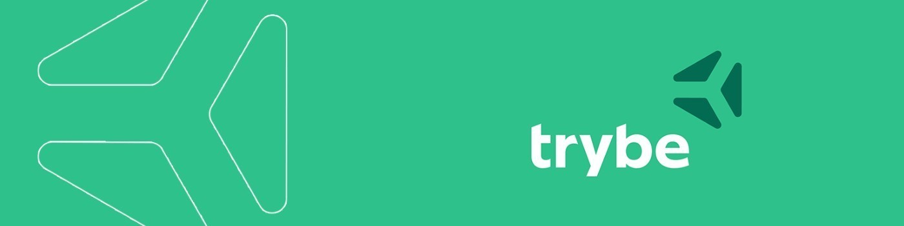

<h3 align="center"><strong>Curso realizado em: 2021 - 2022. || Turma(s): 14a e 15b</strong></h3>

A Trybe é uma escola de desenvolvimento web que oferece mais de 1500 horas de formação abordando fundamentos de desenvolvimento web, desenvolvimento Front e Back-end, ciência da computação, engenharia de software, metodologias ágeis e habilidades comportamentais.

## O Curso é dividido em 4 grandes blocos, sendo eles:

 - **Fundamentos do Desenvolvimento Web;**

 - **Desenvolvimento Front-end**

 - **Desenvolvimento Back-end**

 - **Ciência da Computação**

